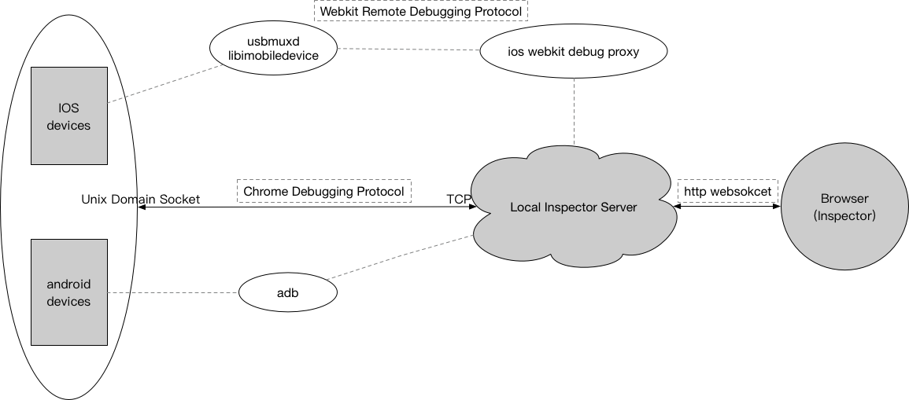
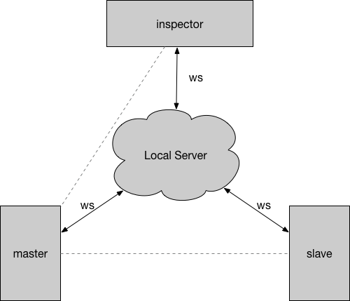

## 真机远程调试技术方案

### 插线远程调试


#### android 端打开远程调试端口
``` java
WebView.setWebContentsDebuggingEnabled(true);
```
android 中添加这行代码后，开启远程调试的端口。android 设备会打开一个unix domain socket 端口用于远程调试协议的通讯。


``` shell
adb shell cat /proc/net/unix | grep --text  _devtools_remote
```
通过执行上面的命令，会得到类似下面的结果 
``` shell
00000000: 00000002 00000000 00010000 0001 01 34141 @webview_devtools_remote_5481 
```
其中 webview_devtools_remote_5481 就是 localabstract 端口号。我们需要通过 adb 命令把这个端口转发到本地 PC 的 TCP 端口上
``` shell
adb forward tcp:4000 localabstract:webview_devtools_remote_5481
```
forward 转发之后就可以用浏览器打开 ```http://localhost:4000/json``` 查看到被调试的页面基础信息，其中 webSocketDebuggerUrl 字段是用于远程调试连接的 websocket

上述操作封装在 [npm adb-tools](https://www.npmjs.com/package/adb-tools) / [源码](https://github.com/songyaru/adb-tools/)


#### ios 端打开端口
开发者账号 build 出的包默认打开了端口 ，参见 [如何替换签名实现 ios 远程调试](https://songyaru.github.io/doc-backup/resign-app/)


### Local Inspector Server 本地 inspector 服务 

#### 1. inspector 静态资源
通过从 chromium 源码中单独抽取出来重新 build

智能小程序在 smartapp 分支: [inspector 源码]( https://github.com/songyaru/devtools-frontend/tree/smartapp)

#### 2. local server
由于智能小程序是 master / slave 的架构，主页面只负责 js 的执行，slave 页面由 master 控制通过数据驱动来渲染显示。常规的 inspector 没法同时调试 js 代码又显示页面的 dom 
结构等信息。因此需要对 inspector 源码做一些处理。 （[npm adb-devtools ](https://www.npmjs.com/package/adb-devtools) /源码待整理后发布）



local server 除了包含 inspector 静态资源服务，还启了一个 websocket 的后台转发服务

##### server 消息转发
``` javascript
// 接收来自 inspector 的消息
socket.on('inspector-server-master-message', (data = {}) => {
    data.from = 'inspector';
    // server 转发给 master
    io.emit('server-master-message', data);
});

// 接收来自 master 页面的消息
socket.on('master-server-inspector-message', (data = {}) => {
    data.from = 'master';
    // server 转发给 inspector
    io.emit('server-inspector-message', data);
});
``` 
server端作为一个消息的中转站，通过 websocket 的双向通信，实现了 inspector 和 master 通信。（master 和 slave 通信类似）

为了把小程序的页面和 server 建立通信，就需要在小程序中的页面插入一段连接 websocket 的脚本。

##### android 端内 webview 页面注入 js
``` java
/**
 * 操作小程序中的 master.html 或 slave.html 文件
 *
 * @param filePath filePath
 * @param target   target
 * @param newLine  代码片段
 * @param isRest  是否重置文件
 */
private static void insertBeforeFile(String filePath, String target, String newLine, boolean isRest) {
    InputStream is = null;
    BufferedReader reader = null;
    BufferedWriter writer = null;
    try {
        File file = new File(filePath);
        String parenPath = file.getParentFile().getAbsolutePath();
        String filename = file.getName();
        File tFile = new File(parenPath + File.separator + filename + ".tmp");
        File bakFile = new File(parenPath + File.separator + filename + ".bak");
        if (isRest) {
            if (bakFile.exists()) {
                bakFile.renameTo(file);
            }
            return;
        }
        is = new FileInputStream(file);
        reader = new BufferedReader(new InputStreamReader(is));
        if (bakFile.exists()) {
            // 保证 file 是原始的文件
            copyFileUsingFileChannels(bakFile, file);
        } else {
            // app 初始的时候备份原始的 file
            copyFileUsingFileChannels(file, bakFile);
        }
        writer = new BufferedWriter(new FileWriter(tFile));
        boolean flag = false;
        String str;
        while ((str = reader.readLine()) != null) {
            if (str.contains(target)) {
                writer.write(newLine + "\n");
                flag = true;
            }
            writer.write(str + "\n");
        }
        writer.flush();
        if (flag) {
            // file.delete();
            // file.renameTo(new File(parenPath + File.separator + filename + ".bak"));
            tFile.renameTo(file);
        } else {
            tFile.delete();
        }
    } catch (Exception e) {
        e.printStackTrace();
    } finally {
        if (reader != null) {
            try {
                reader.close();
            } catch (IOException e) {
                if (DEBUG) {
                    e.printStackTrace();
                }
            }
        }
        if (is != null) {
            try {
                is.close();
            } catch (IOException e) {
                if (DEBUG) {
                    e.printStackTrace();
                }
            }
        }
        if (writer != null) {
            try {
                writer.close();
            } catch (IOException e) {
                if (DEBUG) {
                    e.printStackTrace();
                }
            }
        }
    }
}

```
android 调用上述注入 js 代码 ,核心就是一个 socket.io ,让 webview 页面和 local server 建立连接
``` javascript
let socket = io('http://localhost:8090', {
    'transports': ['websocket', 'polling']
});

socket.on('server-master-message', data => {...});
``` 
由于本地的 server 没有域名和固定 ip ,如何让手机上的 webview 连接到本地的 server 呢？之前我们用了adb forward 把手机的端口转发到 PC。 adb 同时也提供了 reverse 把 PC 的端口转发给手机
```
adbTools.reversePort(8090, serverPort);// adb-tools 封装的 api
```
把本地 PC 的 serverPort 转发到手机的8090端口，手机 webview 可以通过 localhost:8090 访问 PC 的 serverPort。


##### ios 端内 webview 页面注入 js
注入的 js 脚本类似 Android 端，核心就是一个 socket 连接。
注入的方式和 android 方案不一样，采用远程调试协议中的 'Runtime.evaluate' 在页面中执行一段插入脚本
```javascript

var evaluateScript = function (socket, injectedFunction, params) {
    socket.send(JSON.stringify({
        "id": 0,
        "method": "Runtime.evaluate",
        "params": {"expression": "(" + injectedFunction.toString() + ").apply(null,[" + params.toString() + "])"}
    }));
};

var insertScript = function (ip, port, isMaster) {
    var head = document.head || document.getElementsByTagName('head')[0] || document.documentElement;
    var script = document.createElement("script");
    script.src = 'http://' + ip + ':' + port + '/preload/' + (isMaster ? 'master.js' : 'slave.js');
    if (head) {
        if (!head.getAttribute('data-inspector')) {
            head.appendChild(script);
            script.onload = script.onreadystatechange = function () {
                script.onreadystatechange = script.onload = null;
                head.setAttribute('data-inspector', 'true');
                document.title += (isMaster ? '-master' : '-slave');
            };
        }
        return true;
    }
    return false;
};

```
当打开 http://localhost:8090 页面扫描所有设备的可调试页面时，查找到是智能小程序后自动的执行 ```evaluateScript``` 方法，把脚本插入页面。

后续 android 也会改成这种方案，这样就不需要在端内改 html 文件

#### 3. 让 inspector 支持同时连接 master 和 slave
默认情况下，chrome 的 inspector 只支持一个 websocket 连接。 see [Connections.js # 246](https://github.com/songyaru/devtools-frontend/blob/smartapp/front_end/sdk/Connections.js)
``` javascript
/**
 * @param {!Protocol.InspectorBackend.Connection.Params} params
 * @param {function()} connectionLostCallback
 * @return {!Protocol.InspectorBackend.Connection}
 */
SDK.createMainConnection = function(params, connectionLostCallback) {
  const wsParam = Runtime.queryParam('ws');
  const wssParam = Runtime.queryParam('wss');

  if (wsParam || wssParam) {
    const ws = wsParam ? `ws://${wsParam}` : `wss://${wssParam}`;
    return new SDK.WebSocketConnection(ws, connectionLostCallback, params);
  }

  if (InspectorFrontendHost.isHostedMode())
    return new SDK.StubConnection(params);
  return new SDK.MainConnection(params);
};
```
通过 ``` http://localhost:8090/devtools/inspector.html?ws=xxx ``` 传入 master 的 webSocketDebuggerUrl。由于 master 页面只是一个 js 的执行环境没有dom 结构，我们还需要把 slave 页面连上 inspector。 
参见 [adb_custom](https://github.com/songyaru/devtools-frontend/tree/smartapp/front_end/adb_custom/adb_slave_socket.js)
``` javascript
// 建立一个连接
const createSlaveConnection = function (url, isActive) {
    if (isActive === undefined) {
        isActive = true;
    }

    const slaveConnection = {};
    slaveConnection['url'] = url;

    const _createSlaveConnection = params => {

        const onDisconnect = message => {
        };
        let wsConnection = new SDK.WebSocketConnection(url, onDisconnect, {
            onMessage: params.onMessage,
            onDisconnect
        });
        wsConnection.isActive = isActive;
        wsConnection.isSlave = true;
        slaveConnection['connection'] = wsConnection;
        return wsConnection;
    };
    SDK.targetManager.createTarget('slave' + Math.random(), 'Slave', capabilitiesForSlaveTarget(), _createSlaveConnection, null);

    MainInstance.slaveConnections.push(slaveConnection);
    return slaveConnection;
};

```

master 页面知道 slave 页面的跳转和加载等状态，通过 server 转发，master 可以通知 inspector 是否应该要去连接新的 slave 页面或者断开，以及获取 slave 相关信息等操作。
参见 [adb_custom.js](https://github.com/songyaru/devtools-frontend/tree/smartapp/front_end/adb_custom/adb_custom.js) 
``` javascript
// inspector 接收 server 从 master 页面转发过来的消息
socket.on('server-inspector-message', function (data) {
 	const msg = data.msg;
    const type = data.type;
    switch (type) {
		...
    }
});
```

inspector 将 master 和 slave 页面都连接后，还可能需要针对特定的需求处理远程调试的协议信息。

如页面断开连接默认会弹出一个重连的框，由于我们加入了 slave,并且 slave 的 socket 断开是我们预期的，不需要弹重连的框。处理方式见 [InspectorBackend.js #351](https://github.com/songyaru/devtools-frontend/blob/smartapp/front_end/protocol/InspectorBackend.js)
``` javascript
if (this._id !== 'main') {
  //  slave 断开连接事件
  if (messageObject.method == "Inspector.detached") {
    if (messageObject.params && messageObject.params.reason == "target_closed") {
      return;
    }
  }
}
```


### 总结
至此，整个 android 真机插线远程调试的主要技术方案讲解完毕，步骤总结为：

- 把 android 远程调试端口打开
- 编译 chromium 的远程调试相关代码
- 启动一个本地的服务实现端上的页面和开发者工具页面通信

### 相关资料链接
[adb-devtools](https://www.npmjs.com/package/adb-devtools)

[真机调试安装包](https://smartprogram.baidu.com/docs/develop/debug/remoterelease/)

[控制台使用真机调试](https://smartprogram.baidu.com/docs/develop/debug/remotetargettool/)


### 补充
Android 真机不插线远程调试，以及 IOS 真机插线远程调试也是基于上述思路，后续补充。
