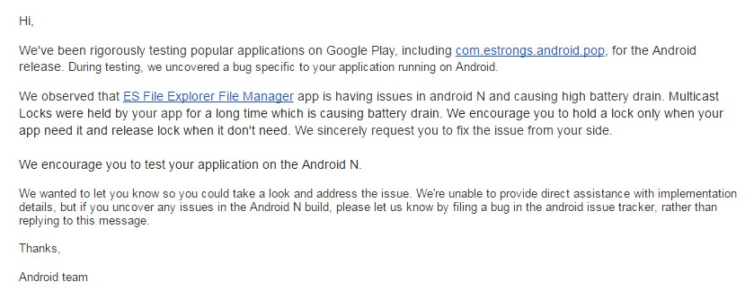

### 起因



google 发了封邮件，ES 一直持有 Multist Locks 导致耗电量增加。


### 解决方案

#### 1.Utils 增加 getWifiManage 方法，防止内存泄露，加上Nullable注解。
On versions prior to Android N (24), initializing the WifiManager via Context#getSystemService can cause a memory leak if the context is not the application context.
``` java
@Nullable
public static WifiManager getWifiManage() {
    return (WifiManager) MainApplication.getInstance().getApplicationContext()
                             .getSystemService(Context.WIFI_SERVICE);
}
```


#### 2.增加锁屏销毁组播，亮屏启动组播。释放监听的端口
``` java

IntentFilter filter=new IntentFilter();
filter.addAction(Intent.ACTION_SCREEN_OFF);
filter.addAction(Intent.ACTION_SCREEN_ON);
MainApplication.getInstance().registerReceiver(mBroadcastReceiver, filter);


case Intent.ACTION_SCREEN_OFF:
    destoryZeroconf(); // 执行 MulticastSocket 的 close 方法关闭组播
    break;
case Intent.ACTION_SCREEN_ON:
    if (NetworkUtils.isWifiAvailable()) {
        initZeroconf(); // 重启组播
    }
    break;

```

#### 3.去掉 MulticastLock 锁
不再需要 MulticastLock 锁，同时方便通过代码静态检查。


### 总结
经过上面的操作，在屏幕打开的时候才监听组播。屏幕关闭的时候就不消耗电量去监听。

同时 ES 有另外的 UDP 端口以及缓存方案去接收局域网的扫描请求，关闭组播不会导致功能的失效。


### 参考
* [MulticastLock API](https://developer.android.com/reference/android/net/wifi/WifiManager.MulticastLock.html)
* [udp-multicast-on-android](http://codeisland.org/2012/udp-multicast-on-android)